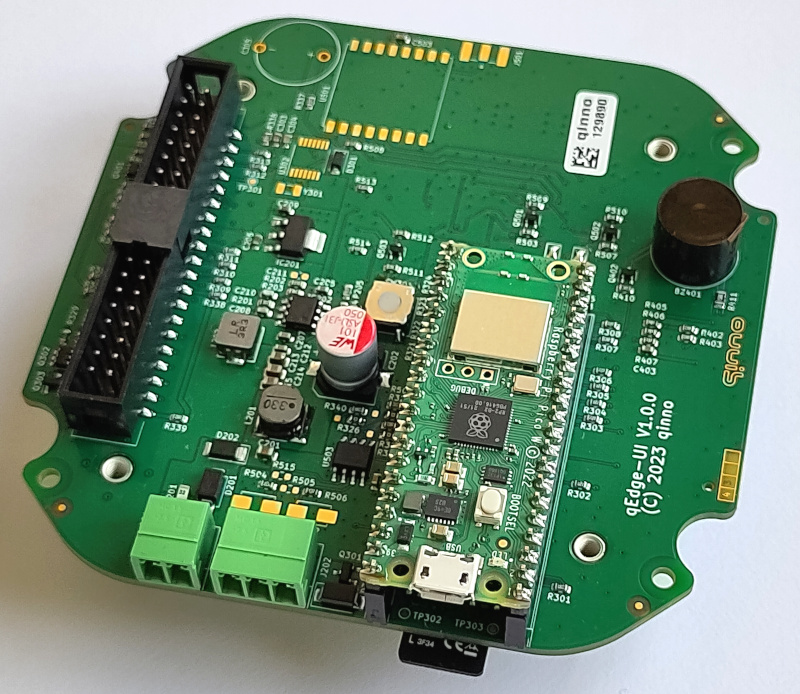
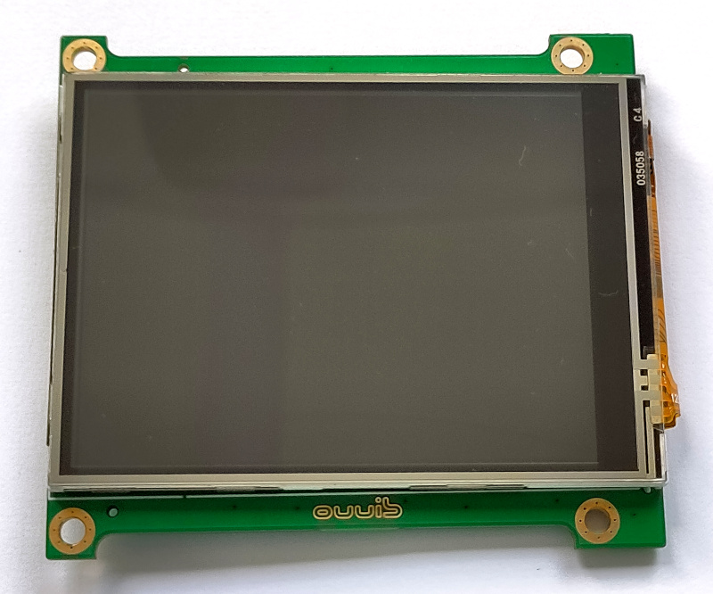
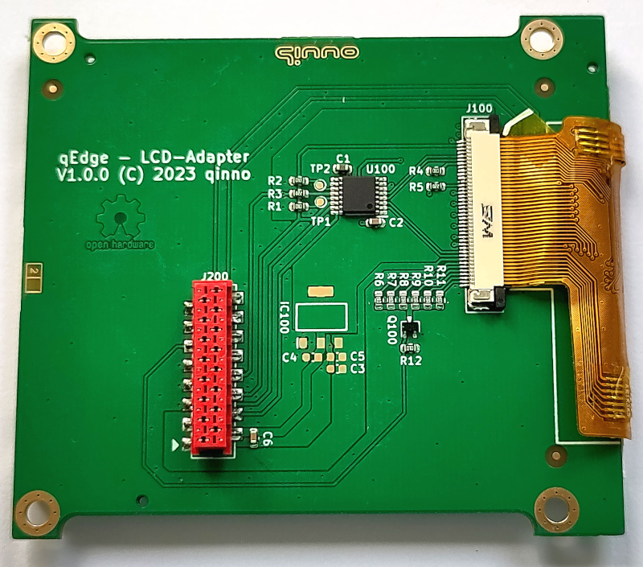
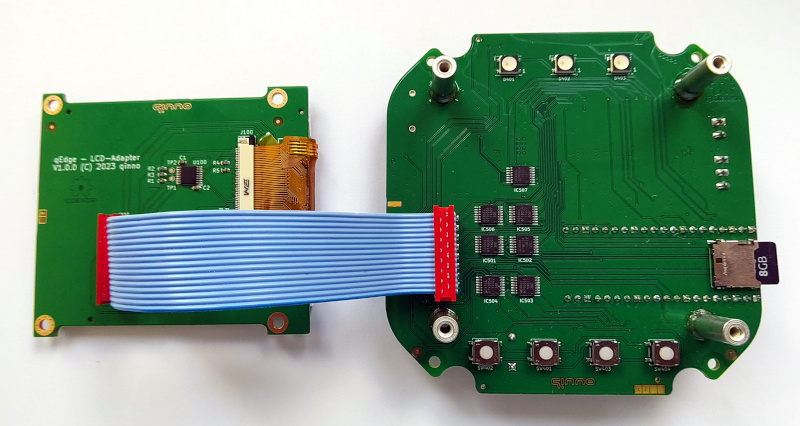
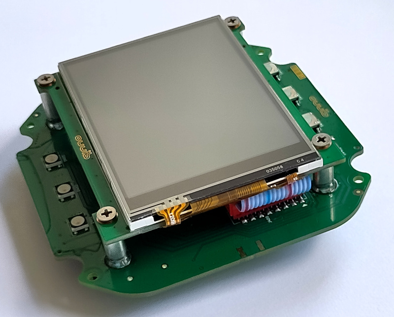

# qEdge-UI electronics

In this directory you will find the complete electronic design in KiCAD.

### The main electronics

[in the directory qedge-UI](qEdge-UI)

### The display adapter board

 [in the directory qEdge-LCD-Adapter](qEdge-LCD-Adapter)

You need to glue the display to the adapter board with double-sided adhesive tape and connect it to the ZIF-connector.

For use with RaspBerry Pi Pico or Pico-W you need to close the Jumpers JP500 and JP501. After you have assembled both boards, you need to connect them with a ribbon cable.

Now screw the LCD display on top of the main board.

You can supply the unit via Micro-USB (5V) and/or via the Phoenix connectors with 12V/24V (mating connector Phoenix 1952267).

The RS-485 connector needs Phoenix mating connector 1952270 to fit.

Fingers crossed ...

# License

(C) 2023 qinno - this work is licensed under CERN-OHL-S
see https://ohwr.org/cern_ohl_s_v2.pdf for more information
