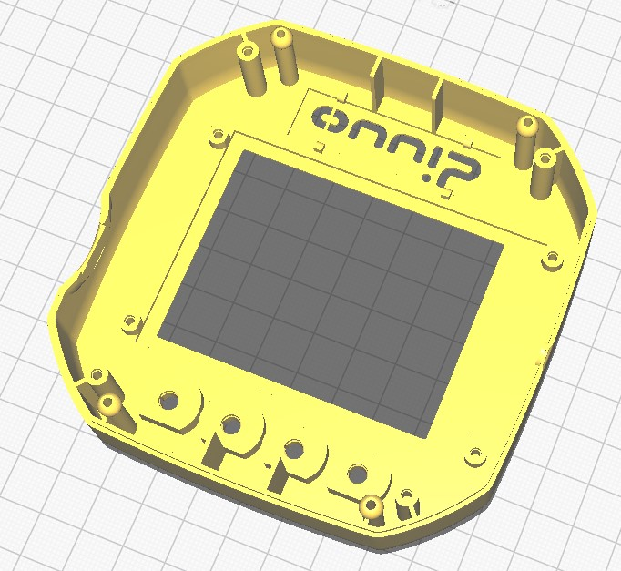
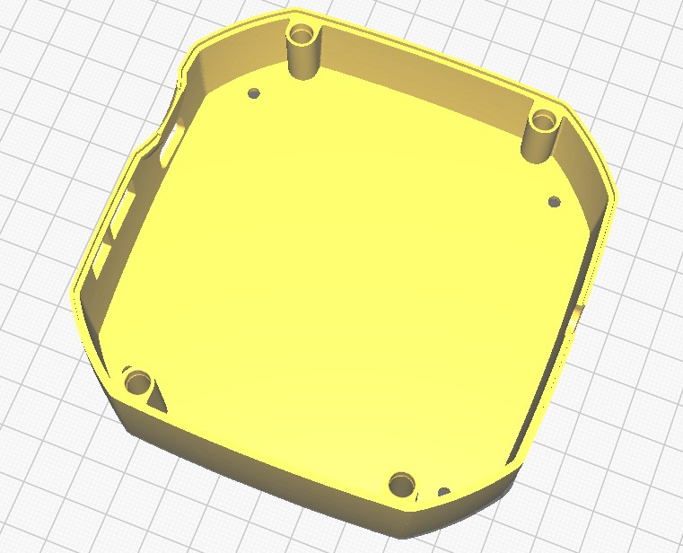
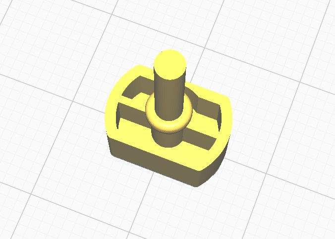
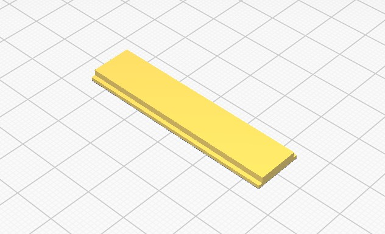

# qEdge-UI mechanics

In this directory you will find the mechanic data to 3D-Print a housing and keys for qEdge-UI. You will find an exploded view under [Assembling](QE.ASM-102_01.pdf).

There are 4 different parts that need to be printed.

# Top housing

# Bottom Housing

# Buttons (4x needed)

# LED Window

You can choose any filamant type and color. However, the GCODE is designed for PLA filament. Use something translucent for the window.

# Tips for printing

Notes on the printability of the qEdge housing, you will find the data

in [STL](./stl) for free printing in all slicers
in [3MF](./3mf) with our presets for easy adjustments
in [GCODE](./gcode) for use with a Prusa MK3S+

Please check the compatibility of the data with your printer. We cannot accept any liability for damage. The files are created with Prusa-SLICER 2.6.0.

## Bottom Housing

- The bottom should be placed flat on the print bed.
- Organic support structures / treesupports are recommended for the fillets.

## Top Housing

- The Top Housing should be placed with the top side facing the print bed. 
  
  - The Button holes also require support structures.
  
  - We do not recommend the use of treesupports here, as they are difficult to remove.  Easy to remove here was the snug option in Prusaslicer.
  
  - Before printing the upper part, we recommend printing our Support-Test STL files.  You can check the type of support structures you have and the position of the buttons without having to print the entire housing.

## Buttons

For printing, it is recommended to print at least 4 buttons at the same time to ensure sufficient cooling of the printed parts.

# License

This work is licensed under the Creative Commons Attribution-NonCommercial 4.0 International License. To view a copy of this license, visit http://creativecommons.org/licenses/by-nc/4.0/ or send a letter to Creative Commons, PO Box 1866, Mountain View, CA 94042, USA.
